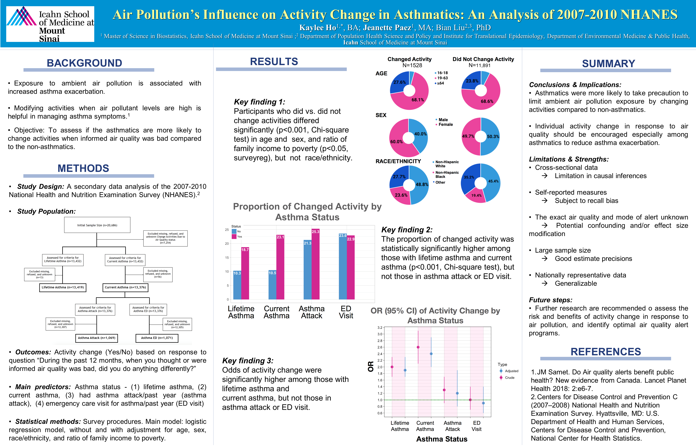
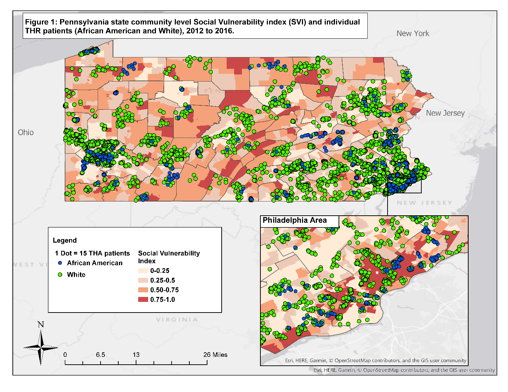
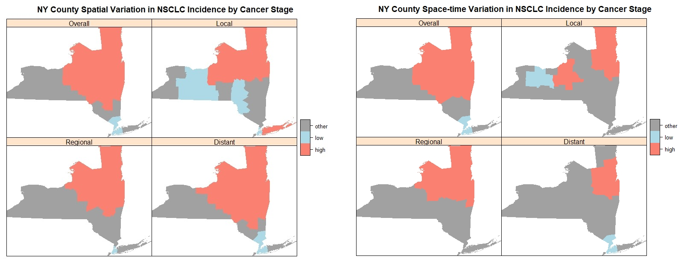

<link rel="stylesheet" href="academicons/css/academicons.min.css"/>

### Research Interests
 

My current research projects are mainly in: 

- Analysis of observational data (working with [Said Ibrahim, MD, MBA](http://vivo.med.cornell.edu/display/cwid-sai2009))
- Geospatial Analysis (working with [Bian Liu, PhD](https://www.mountsinai.org/profiles/bian-liu))
- Pilot phase and interim analysis of multicenter randomized controlled clinical trials (working with [Karla Ballman, PhD](http://vivo.med.cornell.edu/display/cwid-kab2053))

  

### Published Works

 

##### 1. Air Pollution and Activity Change 

**Analysis of CDC National Health and Nutrition Examination Survey (NHANES) Data, 2007-2010**

Here is our published correspondence article on [Lancet Planetary Health](https://www.thelancet.com/journals/lanplh/article/PIIS2542-5196(18)30231-6/fulltext).

This cross-sectional secondary analysis study included individuals from the 2007-2010 National Health and Nutrition Examination Survey (NHANES). The outcome of interest was whether or not the individual (≥16 years old) did anything differently when informed air quality was bad.  We differentiated asthma status into four groups according to the hierarchical survey questions: lifetime asthma, current asthma, defined as those who still had asthma at the time of the survey, those who had an asthma attack in the past year, and those who had an asthma emergency department visit in the past year. Survey logistic regression models, adjusting for age, race/ethnicity, sex, and ratio of family income to poverty, were used to investigate the association between these asthma variables and change in activity due to bad air quality.

  

 

### Current Projects

##### 1.  Data Analysis of Total Hip Arthoplasty (THA) Data

In this large regional dataset (n = 86,214), we sought to examine the impact of social vulnerability on discharge destination after elective THA, and the intereaction between social vulnerability and patient race on post-surgery discharge disposition.  We used the Pennsylvania Health Care Cost Containment Council (PHC4) Database, which includes all patient discharges from 170 non-governmental acute care hospitals in the State of Pennsylvania. We identified patients who underwent elective primary THA performed in the state of Pennsylvania from 2012 to 2016 using the International Classification of Diseases, Ninth Revision, Clinical Modification (ICD-9-CM) code 81.51 for primary THA from 2012 to Sept 2015, and ICD-10 codes 0SR90xx or 0SRB0xx for Q4 2015 to Q4 2016. 

We used multivariable generalized estimating equations (GEE) to test the association between social vulnerability index (SVI) and discharge disposition, adjusting for patient and facility characteristics. We accounted for clustering by hospital facility.  We used an exchangeable working correlation structure, which even if misspecified would not affect the consistency of the estimation of the marginal regression parameters.

  

 

##### 2. Spatiotemporal Trends of Lung Cancer Incidence Rates 

**Spatiotemporal Trends of Stage-specific Incidence Rate of Non-Small Cell Lung Cancer (NSCLC) in New York State (1995-2015)**

Cancer stage at diagnosis of Non-Small Cell Lung Cancer (NSCLC) provides important information about the treatment options and prognosis. Early detection is critical for early stage NSCLC patients as treatment options with curative intent are available. We aim to investigate the spatiotemporal variations in NSCLC incidence rates in New York State (NYS). We used a scan-statistic approach to assess spatial clustering of incidence rates. We obtained county level age-adjusted incidence NSCLC rates and socioeconomic index in NYS between 1995 and 2015 from SEER*Stat maintained by the National Cancer Institute. We conducted weighted space-only normal model using the inverse of the age-adjusted rate standard error, and unweighted, space-time normal model, adjusting for the Yost Index. Models were ran separately for overall and each cancer stage. Significant (p< 0.01) high/low incidence clusters were detected, with variations seen in the cluster sizes and locations between space-only vs. space-time models. The results may be useful for identifying areas where further investigation and targeted NSCLC prevention and interventions, such as lung cancer screening programs, are needed. 

  

 

### Submitted Papers

 

##### 1. Race and Discharge Disposition after Elective Hip Replacment

**Race and Discharge Disposition after Elective Hipe Replacment: Coarsened Exact Matching analysis of a large regional dataset.** 

Bella Mehta, **Kaylee Ho**, Jasvinder Singh, Michael Parks, Debra D’Angelo, Said A. Ibrahim

Retrospective large regional database analysis. We used the Pennsylvania Health Care Cost Containment Council (PHC4) Database to identify total hip arthoplasty patients from 2012-2016. We examined the relationship between patient race and discharge disposition (Home, Home Health Care(HHC), Skilled Nursing Facility(SNF), Inpatient Rehabilitation Facility(IRF)) following elective primary THA; and whether discharge disposition is associated with re-admission to acute care hospital within 90-days.  We used multinomial generalized linear mixed models (GLMM), accounting for clustering by hospital facility. 

For our secondary analysis, the relationship between 90-day readmission and discharge destination was assessed using binary logistic regression.  Unadjusted and adjusted odds ratios (ORs) of hospital readmission at 90 days were estimated.  Multivariable models were adjusted for the same patient-level and facility-level variables from the primary outcome analysis. We used Corsened exact matching(CEM) to further account for unbalanced covariates in our readmission analyses.  After matching, the effect of discharge distination on 90-day readmission was evaluated using a binary logistic model. 

  

   

### Other Analyses 

 

Other (selected) projects I am currently working on are:

 

##### 1. ShangRing vs. Mogen Clamp for Early Infant Male Circumcision in sub-Saharan Africa

**Data and Safety Monitoring Board (DSMB) Evaluation**

Conducting initial and interim analysis for the pilot phase of this clinical trial. The goal is to determine if the AE rate using the ShangRing is not inferior to that for the control i.e. the Mogen clamp. The anticipated moderate/severe AE rate is 2%.  We anticipate that the benefits of ShangRing in terms of convenience and acceptability will allow a non-inferiority margin of 2% (absolute). A formal interim analysis was conducted after the first 100 circumcisions have been completed in the pilot phase. Study recruitment will be suspended for the interim analysis. The analysis will be for futility only. 

 

##### 2. ROMA Trial

**Pilot Phase Evaluation of Randomized comparison of the clinical Outcome of single versus Multiple Arterial grafts**

The pilot phase is aimed at establishing the feasibility of the project, the adherence to the protocol and the enrollment rate. The main objective of the pilot phase is to enroll 430 patients in 5 months at the 25 core centers, with a predicted enrollment rate of approximately 1 patient/center/week.  A consent rate of > 50% of eligible patients, an enrollment rate 80% of the predicted, a rate of compliance with the protocol > 90%, and a loss of follow-up of less than 1% will be considered as a demonstration of feasibility.

   
