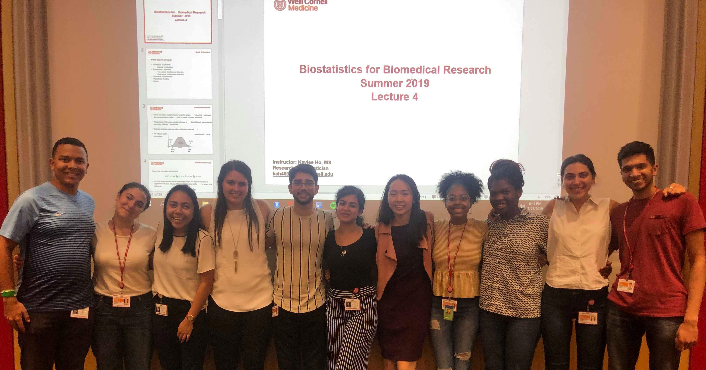

<link rel="stylesheet" href="academicons/css/academicons.min.css"/>

  

 

 

  

### Teaching Assistant Positions

##### Holding regular office hours and grading assignments

* Weill Cornell Medical College 
    + Practicum on Biostatistical Consulting, Spring 2020    Instructor: Paul Christos, DrPH     [Course Info](download/MPII2020.pdf)
    + Biostatistics I, Fall 2020   Instructor: Karla Ballman, PhD    [Course Info](download/biostats1.pdf)
    + SQL Programming: Data Management Course, Spring 2019   Instructor: Debra D'Angelo, MS    [Course Info](download/sql_course.pdf)

* Icahn School of Medicine at Mount Sinai
    + SAS Programming: Computational Tools for Clinical Research - CLR0501, Spring 2018   Instructor: Alan Weinberg    [Course Info](download/sas_course.pdf)
    

### Volunteer Positions

* Weill Cornell Medical College 
    + Instructor, 2019 Summer Biostatistics for Biomedical Research  
    Travelers Summer Research Fellowship Program    
    

### Poster Presentations
* **Ho K**, Paez J, Liu B. Air Pollution’s Influence on Activity Change in Asthmatics: An
Analysis of 2007-2010 NHANES. Poster presentation at the New York City Epidemiology
Forum (NYCEF). February 16, 2018. Newark, NJ, USA.

 

### Abstract Submissions
* [Joint Statistical Meeting 2019](http://ww2.amstat.org/meetings/jsm/2019/): Spatiotemporal Trends of Stage-specific Incidence Rate of Non-Small Cell Lung Cancer (NSCLC) in New York State (1995-2015). *(Presenter)*

* [The North American Association of Central Cancer Registries (NAACCR) and IACR (International Association of Cancer Registries) 2019](https://www.naaccr.org/naaccr-iacr2019/): Spatiotemporal Trends of Stage-specific Incidence Rate of Non-Small Cell Lung Cancer (NSCLC) in New York State (1995-2015). *(Presenter)*

* [European Congress of Rheumatology (EULAR) 2019](https://www.congress.eular.org/): Social Vulnerability and Discharge Disposition after Elective Total Hip Replacement? Risk-adjusted Analysis of Large Regional Dataset.  *(Co-Author)*

 

